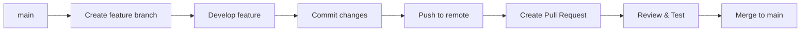

# 📚 Git Complete Guide


A comprehensive guide to mastering Git - from basic concepts to advanced workflows. This guide covers everything you need to know to become proficient with Git version control.

## 📋 Table of Contents

- [🚀 Getting Started](#-getting-started)
- [📁 Basic Concepts](#-basic-concepts)
- [⚡ Quick Start Commands](#-quick-start-commands)
- [📊 Git Command Categories](#-git-command-categories)
- [🔧 Advanced Features](#-advanced-features)
- [🔄 Workflows](#-workflows)
- [🎯 Pro Tips](#-pro-tips)
- [🚨 Common Scenarios](#-common-scenarios)
- [📖 Cheat Sheet](#-cheat-sheet)
- [📚 Resources](#-resources)

## 🚀 Getting Started

### Installation

```bash
# Ubuntu/Debian
sudo apt install git

# macOS
brew install git

# Windows
# Download from: https://git-scm.com/download/win
```

### First-Time Setup

```bash
git config --global user.name "Your Name"
git config --global user.email "your.email@example.com"
git config --global init.defaultBranch main
```

## 📁 Basic Concepts

| Concept | Description |
|---------|-------------|
| **Repository** | Your project folder that Git tracks |
| **Commit** | Snapshot of your project at a specific time |
| **Branch** | Parallel version of your codebase |
| **HEAD** | Pointer to your current location |
| **Staging Area** | Where you prepare changes before committing |
| **Remote** | Repository hosted elsewhere (GitHub, GitLab, etc.) |

## ⚡ Quick Start Commands

### Initialize & Clone
```bash
git init                    # Start new repository
git clone <url>            # Copy existing repository
```

### Basic Workflow
```bash
git add <file>             # Stage changes
git commit -m "message"    # Save changes
git push                   # Upload to remote
git pull                   # Download updates
```

### Branch Management
```bash
git branch                 # List branches
git checkout -b feature    # Create and switch to new branch
git merge feature          # Merge branch into current
```

## 📊 Git Command Categories

### 🔧 Setup & Configuration
| Command | Description |
|---------|-------------|
| `git config` | Configure Git settings |
| `git init` | Initialize new repository |
| `git clone` | Copy existing repository |

### 📝 Making Changes
| Command | Description |
|---------|-------------|
| `git add` | Stage files for commit |
| `git commit` | Save staged changes |
| `git status` | Check repository status |

### 🌿 Branch Management
| Command | Description |
|---------|-------------|
| `git branch` | List/create/delete branches |
| `git checkout` | Switch branches |
| `git switch` | New way to switch branches |
| `git merge` | Combine branches |

### 🔄 Remote Operations
| Command | Description |
|---------|-------------|
| `git push` | Upload to remote |
| `git pull` | Download from remote |
| `git fetch` | Download without merging |
| `git remote` | Manage remote connections |

### ⏪ Undoing Changes
| Command | Description |
|---------|-------------|
| `git reset` | Undo commits |
| `git revert` | Safe undo with new commit |
| `git restore` | Restore files |
| `git clean` | Remove untracked files |

### 📋 History & Inspection
| Command | Description |
|---------|-------------|
| `git log` | View commit history |
| `git diff` | See changes |
| `git show` | Show commit details |
| `git blame` | See who changed what |

## 🔧 Advanced Features

### Stashing
```bash
git stash                  # Save changes temporarily
git stash list             # View stashes
git stash pop              # Apply and remove stash
git stash apply            # Apply but keep stash
```

### Interactive Rebase
```bash
git rebase -i HEAD~3       # Reorder/squash last 3 commits
# Options: pick, reword, edit, squash, fixup, drop
```

### Cherry Picking
```bash
git cherry-pick <commit-hash>  # Apply specific commit
```

### Bisect (Bug Hunting)
```bash
git bisect start
git bisect bad             # Mark current as bad
git bisect good <commit>   # Mark known good commit
git bisect reset           # Exit bisect mode
```

## 🔄 Workflows

### Feature Branch Workflow


### Git Flow
```bash
# Main branches
main      # Production code
develop   # Integration branch

# Supporting branches
feature/  # New features
release/  # Preparation for release
hotfix/   # Emergency fixes
```

### GitHub Flow
1. Create branch from `main`
2. Add commits
3. Open Pull Request
4. Discuss and review
5. Deploy and test
6. Merge to `main`

## 🎯 Pro Tips

### 1. Commit Best Practices
- ✨ **Commit often**: Small, focused commits
- 📝 **Write clear messages**: Use imperative mood
- 🔍 **Review before commit**: `git diff --cached`

### 2. Branch Strategy
- 🌿 **Feature branches**: One feature per branch
- 🏷️ **Naming**: Use prefixes like `feature/`, `bugfix/`, `hotfix/`
- 🧹 **Clean up**: Delete merged branches

### 3. Remote Operations
- 🔄 **Pull before push**: Avoid conflicts
- 🛡️ **Avoid force push** on shared branches
- 📊 **Preview push**: `git log --oneline origin/main..HEAD`

### 4. Safety First
- 🔍 **Use `--dry-run`** before destructive operations
- 📜 **Check `git status`** frequently
- 💾 **Push regularly** for backup

## 🚨 Common Scenarios & Solutions

### "I committed to wrong branch"
```bash
git checkout correct-branch
git cherry-pick <commit-hash>
git checkout wrong-branch
git reset --hard HEAD~1
```

### "I want to undo everything"
```bash
git reset --hard HEAD
git clean -fd
```

### "Lost a commit"
```bash
git reflog                    # Find lost commit
git checkout <commit-hash>    # Recover it
```

### "Merge conflict resolution"
```bash
# During merge conflict
git status                    # See conflicted files
# Edit files to resolve conflicts
git add <resolved-file>
git commit
# OR for rebase
git rebase --continue
```

### "Accidental commit to main"
```bash
git checkout -b feature-branch
git checkout main
git reset --hard HEAD~1
git checkout feature-branch
```

## 📖 Cheat Sheet

### Essential Commands
| Task | Command |
|------|---------|
| Initialize | `git init` |
| Clone | `git clone <url>` |
| Status | `git status` |
| Add all | `git add .` |
| Commit | `git commit -m "message"` |
| Push | `git push origin main` |
| Pull | `git pull origin main` |
| Log | `git log --oneline` |
| Diff | `git diff` |

### Branch Operations
| Task | Command |
|------|---------|
| List branches | `git branch` |
| Create branch | `git branch <name>` |
| Switch branch | `git checkout <name>` |
| Create & switch | `git checkout -b <name>` |
| Delete branch | `git branch -d <name>` |
| Merge | `git merge <branch>` |

### Undo Operations
| Task | Command |
|------|---------|
| Unstage file | `git restore --staged <file>` |
| Discard changes | `git restore <file>` |
| Undo commit (keep changes) | `git reset HEAD~1` |
| Undo commit (hard) | `git reset --hard HEAD~1` |
| Safe undo | `git revert HEAD` |

## 📚 Resources

### Documentation
- [Official Git Documentation](https://git-scm.com/doc)
- [Pro Git Book](https://git-scm.com/book/en/v2) (Free!)

### Tutorials & Learning
- [GitHub Learning Lab](https://lab.github.com/)
- [Atlassian Git Tutorial](https://www.atlassian.com/git/tutorials)
- [Git Immersion](https://gitimmersion.com/)

### Tools & Extensions
- **GUI Clients**: GitKraken, SourceTree, GitHub Desktop
- **IDE Integration**: VS Code, IntelliJ, Eclipse
- **Git Aliases**: Custom shortcuts for common commands

### Community
- [Stack Overflow Git Tag](https://stackoverflow.com/questions/tagged/git)
- [GitHub Community Forum](https://github.community/)
- [Reddit r/git](https://www.reddit.com/r/git/)

---

## 📄 License

This guide is provided under the MIT License. Feel free to use, modify, and distribute as needed.

## 🤝 Contributing

Found an error or have a suggestion? Feel free to:
1. Fork the repository
2. Create a feature branch
3. Make your changes
4. Submit a pull request

---

<div align="center">
  
### ⭐ Star this guide if you found it helpful!
  
**Happy Coding!** 🚀

</div>

---

## 🎓 Learning Path

### Beginner (Week 1-2)
1. Install Git and configure
2. Learn `init`, `clone`, `add`, `commit`, `push`
3. Understand basic branching

### Intermediate (Week 3-4)
1. Master merging and conflict resolution
2. Learn stashing and undo operations
3. Practice with remote repositories

### Advanced (Week 5+)
1. Master rebasing and interactive rebase
2. Learn Git hooks and aliases
3. Implement complex workflows

---

<div align="center">
  
**"Git is not just a tool, it's a way of thinking about your code's history."**

</div>